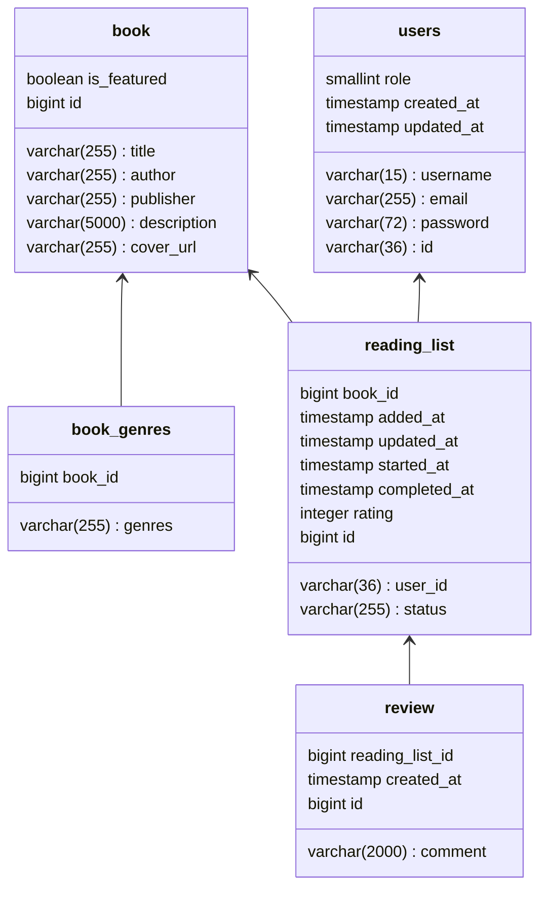

# hahn-challenge

A minimal Goodreads clone, featuring user authentication, book browsing, reviews, reading lists, and admin management tools.


## Pages

- **Home:** Overview of featured and popular books (`/`)
- **Login:** User authentication (`/login`)
- **Sign Up:** User registration (`/sign-up`)
- **Browse Books:** List and search all books (`/browse`)
- **Book Details:** Detailed view of a book, reviews, and ratings. Users can add, update, or remove the book from their own reading list here (`/books/:id`).
- **User Profile:** View user details and reviews (`/user/:username`)
- **User Reading List:** Manage your reading list (`/user/:username/reading-list`)
- **User Settings:** Edit your profile and preferences (`/user/:username/settings`)
- **Admin - Book Management:** Admin interface for managing books (`/admin/books`)
- **Admin - User Management:** Admin interface for managing users (`/admin/users`)

## Default Users

A default admin user is provided:
- **Username:** `admin`
- **Password:** `admin`


## Project Structure

- `bookspace-back/` — Spring Boot backend (Java 17, Maven)
- `bookspace-client/` — Vite + React + TypeScript frontend

## DB structure



## Backend: Spring Boot

### Prerequisites

- Java 17+
- Maven 3.8+
- PostgreSQL (or compatible DB)

### Configuration

Edit `bookspace-back/src/main/resources/application.yml` to set your database credentials:

```yaml
spring:
  datasource:
    url: jdbc:postgresql://localhost:5432/bookspace
    username: postgres
    password: postgres
    driver-class-name: org.postgresql.Driver
```

- `url`: JDBC connection string to your PostgreSQL instance.
- `username`: Your DB username.
- `password`: Your DB password.

> **Note:** The default config uses `postgres`/`postgres` and expects a local DB named `bookspace`.

### Build & Run

From the `bookspace-back` directory:

```sh
# Build the project
./mvnw clean install

# Run the application
./mvnw spring-boot:run
```

The backend will start on port `1001` by default (see `server.port` in `application.yml`).

- **API Docs:** The backend exposes Swagger UI at `/swagger/swagger-ui/index.html` (e.g., `http://localhost:1001/swagger/swagger-ui/index.html`).

- **Database Migrations:** Managed by Liquibase (see `spring.liquibase` in `application.yml`).

## Frontend: Vite + React

### Prerequisites

- Node.js (v18+ recommended)
- npm (v9+ recommended)

### Install Dependencies

From the `bookspace-client` directory:

```sh
npm install
```

### Development Server

```sh
npm run dev
```

- The app will be available at the URL printed in the terminal (usually `http://localhost:5173`).
